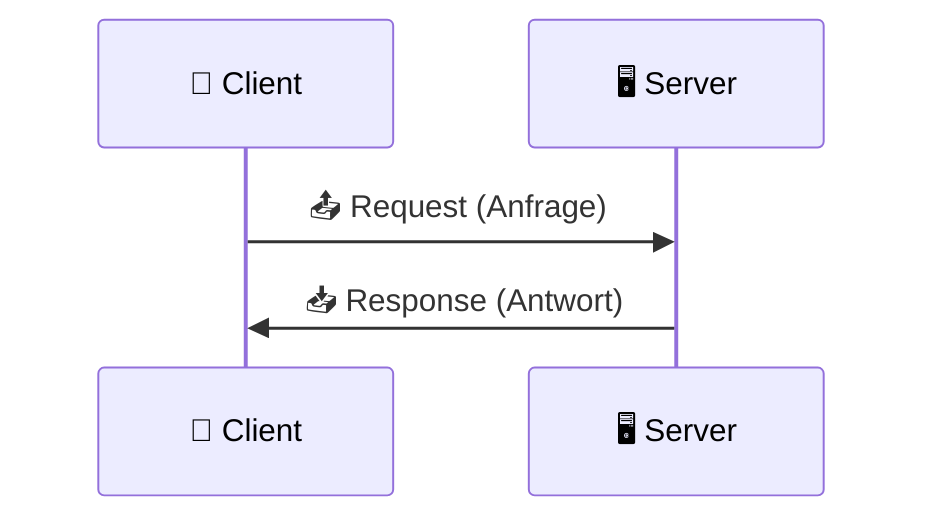

# 🌐 Schnittstellen und APIs - Theorie und Aufgaben

<div align="center">


**Eine umfassende Einführung in die Welt der APIs und Schnittstellen**

</div>

---

## 📹 Erklärvideos

### 🇺🇸 **Englischsprachige Ressourcen**

<table>
<tr>
<td width="50%">

**📺 [Code With Chris - API Basics](https://www.youtube.com/watch?v=Yzx7lhtCGBs&ab_channel=CodeWithChris)**
- ⏱️ Grundlagen der API-Entwicklung
- 🎯 Anfängerfreundlich erklärt
- 💡 Praktische Beispiele

</td>
<td width="50%">

**📺 [ByteByteGo - API Architecture](https://www.youtube.com/watch?v=-mN3VyJuCjM&t=17s&ab_channel=ByteByteGo)**
- 🏗️ API-Architektur Deep Dive
- 📊 Systemdesign Konzepte
- 🔧 Best Practices

</td>
</tr>
</table>

### 🇩🇪 **Deutschsprachige Ressourcen**

<table>
<tr>
<td width="50%">

**📺 [Coding Crashkurse - APIs verstehen](https://www.youtube.com/watch?v=xpeQz7Hsfz0&ab_channel=CodingCrashkurse)**
- 🎓 Deutsche Erklärungen
- 🚀 Schneller Einstieg
- 🔍 Detaillierte Konzepte

</td>
<td width="50%">

**📺 [infoBoardTV - API Tutorial](https://www.youtube.com/watch?v=B7imTwBOOEU&ab_channel=infoBoardTV)**
- 📚 Umfassende Theorie
- 💻 Praktische Anwendung
- 🎯 Deutsche Fachbegriffe

</td>
</tr>
</table>

---

## 🎓 Theoretische Fragen & Antworten

### 🔍 **Grundlagen**

<details>
<summary><strong>1. 🤔 Was ist eine API?</strong></summary>

> **API (Application Programming Interface)** ist eine Schnittstelle, die es verschiedenen Softwareanwendungen ermöglicht, miteinander zu kommunizieren und Daten auszutauschen.

```
📱 App A  ─────[Request]────►  🌐 API  ◄────[Request]───── 📱 App B
   ▲                              │                           ▲
   │                              │                           │
   └────────[Response]◄───────────┘                           │
                                  │                           │  
                                  └─────[Response]────────────┘
```

**Visualisierung:**
- 📱 **Clients** (Apps) senden Anfragen an die API
- 🌐 **API** verarbeitet alle Anfragen zentral
- 🔄 **Bidirektionale Kommunikation** zwischen Apps über die API

</details>

<details>
<summary><strong>2. 🔌 Was ist eine Schnittstelle?</strong></summary>

> Eine **Schnittstelle** ist ein Verbindungspunkt zwischen zwei Systemen, Komponenten oder Geräten, der die Kommunikation und Datenübertragung ermöglicht.

</details>

<details>
<summary><strong>3. ⚡ Was ist der Unterschied zwischen einer Schnittstelle und einer API?</strong></summary>

<table>
<tr>
<th>🔧 Schnittstelle</th>
<th>🌐 API</th>
</tr>
<tr>
<td>Allgemeiner Begriff für jede Art von Verbindung zwischen Systemen</td>
<td>Spezifische Art von Schnittstelle für Software-Kommunikation</td>
</tr>
</table>

</details>

<details>
<summary><strong>4. 🎯 Wofür nutzt man Schnittstellen und APIs?</strong></summary>

- 🔄 **Daten austauschen** zwischen verschiedenen Systemen
- ⚙️ **Funktionen anderer Dienste** nutzen
- 🧩 **Modularität** in der Softwareentwicklung
- 🤝 **Integration von Drittanbieter-Services**

</details>

### 🌐 **Client-Server Architektur**

<details>
<summary><strong>5. 🖥️ Was ist der Unterschied zwischen einem Client und einem Server?</strong></summary>

<div align="center">



</div>

| Rolle | Funktion |
|-------|----------|
| **📱 Client** | Sendet Anfragen (Requests) |
| **🖥️ Server** | Verarbeitet Anfragen und sendet Antworten (Responses) |

</details>

### 📊 **Praxisbeispiele**

<details>
<summary><strong>6. 📈 Beispiel aus dem Datenanalyst-Alltag</strong></summary>

> Ein **Datenanalyst** kann APIs nutzen, um:
> - 📱 Echtzeit-Daten von **Social-Media-Plattformen**
> - 🌤️ Wetterdaten von **Wetterdiensten**  
> - 💹 Finanzdaten von **Börsen-APIs**
> 
> direkt in Analyse-Tools zu importieren.

**Beispiel-Code:**
```python
import requests

# Twitter API für Sentiment-Analyse
response = requests.get('https://api.twitter.com/2/tweets/search/recent', 
                       params={'query': 'python'})
tweets = response.json()
```

</details>

### 🔧 **Protokolle & Standards**

<details>
<summary><strong>7. 📋 Woraus besteht ein Protokoll?</strong></summary>

> Ein **Protokoll** besteht aus:
> - 📝 **Regeln** für die Kommunikation
> - 📊 **Standards** für Datenformat
> - 🔒 **Sicherheitsrichtlinien**
> 
> **Zweck:** Standardisierung des Datenaustauschs zwischen Systemen

</details>

<details>
<summary><strong>8. 🌐 Beispiel für ein Protokoll</strong></summary>

> **HTTP (Hypertext Transfer Protocol)**
> 
> ```http
> GET /api/users/123 HTTP/1.1
> Host: api.example.com
> Authorization: Bearer token123
> ```

</details>

### 📜 **Geschichte der APIs**

<details>
<summary><strong>9. 🕰️ Erste APIs in den 1940er-1950er Jahren</strong></summary>

> **Bibliotheksfunktionen** in Programmiersprachen wie **FORTRAN**
> 
> ```fortran
> CALL SQRT(X, RESULT)  ! Erste API-ähnliche Funktionen
> ```

</details>

### 🏗️ **Programmierparadigmen**

<details>
<summary><strong>10. 🧩 Modulare vs. Objektorientierte Programmierung</strong></summary>

<table>
<tr>
<th>🧩 Modulare Programmierung</th>
<th>🎯 Objektorientierte Programmierung</th>
</tr>
<tr>
<td>Aufteilung in <strong>unabhängige Module</strong></td>
<td>Organisation um <strong>Objekte</strong> mit Eigenschaften und Methoden</td>
</tr>
<tr>
<td>

```python
# Modul: math_utils.py
def calculate_sum(a, b):
    return a + b
```

</td>
<td>

```python
# Klasse: Calculator
class Calculator:
    def calculate_sum(self, a, b):
        return a + b
```

</td>
</tr>
</table>

</details>

<details>
<summary><strong>11. 🔒 Kapselung in APIs</strong></summary>

> **Kapselung** bedeutet:
> - 🔒 **Implementierungsdetails** werden verborgen
> - 👁️ Nur die **Schnittstelle** ist sichtbar
> - 🛡️ **Interne Logik** bleibt geschützt

</details>

### 🌐 **API-Technologien**

<details>
<summary><strong>12. 🔄 SOAP-Wendepunkt in den 1990ern</strong></summary>

> **SOAP** war revolutionär, weil es:
> - 📏 **Web-basierte Kommunikation** standardisierte
> - 📄 **XML** als universelles Format einführte
> - 🌍 **Plattformübergreifende Integration** ermöglichte

</details>

<details>
<summary><strong>13. 🚀 Was ist eine RESTful API?</strong></summary>

> Eine **RESTful API** folgt dem **REST-Architekturstil**:
> - 🔄 **Zustandslos** (Stateless)
> - 💾 **Cachebar**
> - 🎯 **Einheitliche Schnittstelle**
> - 📊 **Ressourcen-orientiert**

**REST-Prinzipien:**
```http
GET    /api/users      # Alle Benutzer abrufen
POST   /api/users      # Neuen Benutzer erstellen
PUT    /api/users/123  # Benutzer 123 aktualisieren
DELETE /api/users/123  # Benutzer 123 löschen
```

</details>

<details>
<summary><strong>14. ⚔️ REST vs. SOAP</strong></summary>

<div align="center">

| Feature | 🚀 REST | 🏢 SOAP |
|---------|---------|---------|
| **Komplexität** | ✅ Einfacher | ❌ Komplexer |
| **Protokoll** | 🌐 HTTP-basiert | 📋 Protokoll-basiert |
| **Datenformat** | 📊 JSON/XML | 📄 Nur XML |
| **Zustand** | 🔄 Zustandslos | 💾 Zustandsbehaftet möglich |
| **Performance** | ⚡ Schneller | 🐌 Langsamer |

</div>

</details>

<details>
<summary><strong>15. 📊 JSON vs. XML</strong></summary>

<table>
<tr>
<th>🟡 JSON</th>
<th>🟠 XML</th>
</tr>
<tr>
<td>

```json
{
  "user": {
    "id": 123,
    "name": "Max Mustermann"
  }
}
```

**Vorteile:**
- ⚡ Leichter
- 👁️ Einfacher zu lesen
- 📉 Weniger Overhead

</td>
<td>

```xml
<user>
  <id>123</id>
  <name>Max Mustermann</name>
</user>
```

**Vorteile:**
- 🏗️ Strukturierter
- 📋 Mehr Metadaten
- 🔧 Besser für komplexe Daten

</td>
</tr>
</table>

</details>

### ☁️ **Cloud & API-Modelle**

<details>
<summary><strong>16. ☁️ Vorteile von Cloud-basierten APIs</strong></summary>

- 📈 **Skalierbarkeit** - Automatische Anpassung an Last
- 💰 **Geringere Wartungskosten** - Managed Services
- 🌍 **Globale Verfügbarkeit** - Weltweite Erreichbarkeit
- 🔄 **Automatische Updates** - Immer aktuelle Version

</details>

<details>
<summary><strong>17. 🔓 Öffentliche vs. Private APIs</strong></summary>

<div align="center">

| 🌍 Öffentliche API | 🔒 Private API |
|-------------------|----------------|
| Für **externe Entwickler** zugänglich | Nur für **interne Nutzung** |
| Dokumentation verfügbar | Interne Dokumentation |
| Rate Limiting | Keine Beschränkungen |

</div>

**Beispiele:**
- 🌍 **Öffentlich:** Twitter API, Google Maps API
- 🔒 **Privat:** Interne Microservices, Datenbank-APIs

</details>

---

## 🎯 Praktische Aufgaben & Lösungen

### 🏆 **Aufgabe 1: APIs im Alltag**

<div align="center">

**🤔 Erkenne APIs in deinem täglichen Leben!**

</div>

<table>
<tr>
<th>📱 Anwendung</th>
<th>🔧 API-Funktion</th>
<th>💡 Technische Details</th>
</tr>
<tr>
<td><strong>🏦 Mobile Banking App</strong></td>
<td>Kontostände und Überweisungen</td>
<td>REST API mit OAuth 2.0</td>
</tr>
<tr>
<td><strong>📱 Social Media Login</strong></td>
<td>Authentifizierung</td>
<td>OAuth API (Facebook, Google)</td>
</tr>
<tr>
<td><strong>🚚 Lieferdienst-App</strong></td>
<td>Standortverfolgung und Bestellstatus</td>
<td>GPS API + WebSocket Updates</td>
</tr>
</table>

**🔍 Zusätzliche Beispiele:**
- 🎵 **Spotify** - Musik-Streaming API
- 🌤️ **Wetter-App** - OpenWeatherMap API
- 🗺️ **Navigation** - Google Maps API

---

### 🏆 **Aufgabe 2: API vs. Webseite**

<div align="center">

**🤔 Situation: Google zeigt Wetterdaten in Suchergebnissen**

</div>

> **🎯 Antwort:** Google nutzt **definitiv eine API**!
> 
> **🔍 Warum?**
> - Wetterdaten kommen von **externen Wetterdiensten**
> - **Echtzeitdaten** werden dynamisch abgerufen
> - **Strukturierte Daten** werden über APIs übertragen

```
🔍 Google Search ─────[API Request]────► 🌤️ Weather Service
        ▲                                         │
        │                                         │
        └────────[JSON Response]◄─────────────────┘
        │
        ▼
     👤 User
```

**Ablauf:**
1. 🔍 Google sendet **API-Anfrage** an Wetterdienst
2. 🌤️ Wetterdienst antwortet mit **JSON-Daten**  
3. 👤 User erhält **aufbereitete Wetterinformationen**

---

### 🏆 **Aufgabe 3: API als Dolmetscher**

<div align="center">

**🗣️ APIs sind wie Dolmetscher zwischen verschiedenen Systemen**

</div>

#### **🤝 Gemeinsamkeiten:**

<table>
<tr>
<td width="50%">

**🗣️ Dolmetscher**
- Übersetzt zwischen Sprachen
- Ermöglicht Kommunikation
- Abstrahiert sprachliche Komplexität
- Standardisierte Übersetzung

</td>
<td width="50%">

**🌐 API**
- Übersetzt zwischen Systemen
- Ermöglicht Datenaustausch
- Abstrahiert technische Details
- Standardisierte Schnittstelle

</td>
</tr>
</table>

#### **😵 Warum wäre es chaotisch ohne APIs?**

> **🚨 Die Probleme:**
> 
> - 🔧 **Inkompatible Systeme** - Jedes System spricht "eigene Sprache"
> - 📏 **Keine Standardisierung** - Wildwuchs von Datenformaten
> - 💸 **Höherer Entwicklungsaufwand** - Jede Integration von Grund auf neu
> - ♻️ **Geringere Wiederverwendbarkeit** - Code kann nicht wiederverwendet werden

```
🚨 OHNE APIs - Chaos & Komplexität:

    📱 System A ←→ 💻 System B
         ↕           ↕
    📺 System C ←──────┘
    
    ❌ Probleme:
    • Direkte Verbindungen zwischen allen Systemen
    • Jede Änderung betrifft mehrere Systeme
    • Hoher Wartungsaufwand

✅ MIT APIs - Zentrale Steuerung:

    📱 System A
         ↓
    🌐 API Gateway ← Zentrale Verwaltung
         ↓     ↓
    💻 System B  📺 System C
    
    ✅ Vorteile:
    • Zentrale Schnittstelle für alle Systeme
    • Einfachere Wartung und Updates
    • Standardisierte Kommunikation
```

---

### 🏆 **Aufgabe 4: Datenformate in APIs**

<div align="center">

**📊 Welche Daten werden über APIs ausgetauscht?**

</div>

#### **📋 Häufige Datenformate:**

<table>
<tr>
<th>Format</th>
<th>Vollständiger Name</th>
<th>Verwendung</th>
<th>Popularität</th>
</tr>
<tr>
<td><strong>🟡 JSON</strong></td>
<td>JavaScript Object Notation</td>
<td>Web APIs, Mobile Apps</td>
<td>⭐⭐⭐⭐⭐</td>
</tr>
<tr>
<td><strong>🟠 XML</strong></td>
<td>eXtensible Markup Language</td>
<td>Enterprise, SOAP APIs</td>
<td>⭐⭐⭐</td>
</tr>
<tr>
<td><strong>📊 CSV</strong></td>
<td>Comma Separated Values</td>
<td>Datenexport, Analytics</td>
<td>⭐⭐⭐⭐</td>
</tr>
</table>

#### **💻 Praxisbeispiele:**

<details>
<summary><strong>🟡 JSON Beispiel - User API</strong></summary>

```json
{
  "user": {
    "id": 123,
    "name": "Max Mustermann",
    "email": "max@example.com",
    "profile": {
      "avatar": "https://example.com/avatar.jpg",
      "bio": "Software Developer",
      "location": "Berlin, Germany"
    },
    "settings": {
      "notifications": true,
      "theme": "dark"
    }
  },
  "metadata": {
    "timestamp": "2025-10-06T14:30:00Z",
    "version": "1.2"
  }
}
```

**👍 Vorteile:**
- ⚡ Kompakt und schnell
- 👁️ Menschenlesbar
- 🔧 Native JavaScript-Support

</details>

<details>
<summary><strong>🟠 XML Beispiel - Enterprise API</strong></summary>

```xml
<?xml version="1.0" encoding="UTF-8"?>
<user xmlns="http://api.example.com/user" version="1.2">
  <id>123</id>
  <name>Max Mustermann</name>
  <email>max@example.com</email>
  <profile>
    <avatar>https://example.com/avatar.jpg</avatar>
    <bio>Software Developer</bio>
    <location country="DE">Berlin, Germany</location>
  </profile>
  <settings>
    <notifications enabled="true"/>
    <theme>dark</theme>
  </settings>
  <metadata timestamp="2025-10-06T14:30:00Z"/>
</user>
```

**👍 Vorteile:**
- 🏗️ Strenge Struktur
- 📋 Schema-Validierung
- 📄 Namespace-Support

</details>

---

## 🎯 Zusammenfassung

<div align="center">

**🌟 APIs und Schnittstellen sind die Grundpfeiler der modernen Softwareentwicklung**

</div>

### 🚀 **Wichtigste Erkenntnisse:**

<table>
<tr>
<td width="25%">

**🤝 Interoperabilität**
- Systeme können kommunizieren
- Plattformübergreifende Integration
- Nahtloser Datenaustausch

</td>
<td width="25%">

**⚡ Entwicklungsgeschwindigkeit**
- Wiederverwendbare Komponenten
- Schnellere Time-to-Market
- Reduzierter Code-Aufwand

</td>
<td width="25%">

**♻️ Wiederverwendbarkeit**
- DRY-Prinzip (Don't Repeat Yourself)
- Modulare Architektur
- Skalierbare Lösungen

</td>
<td width="25%">

**🎯 Komplexitätsreduktion**
- Abstraktionsebenen
- Vereinfachte Integration
- Bessere Wartbarkeit

</td>
</tr>
</table>

### 📊 **Technologie-Stack:**

```
🏗️ API TECHNOLOGIE-STACK

┌─────────────────┬─────────────────┬─────────────────┬─────────────────┐
│   🌐 Protokolle  │  🏗️ Architekturen │   📊 Datenformate │    ☁️ Plattformen   │
├─────────────────┼─────────────────┼─────────────────┼─────────────────┤
│   • HTTP/HTTPS  │     • REST      │     • JSON      │   • AWS Gateway  │
│   • WebSocket   │   • GraphQL     │     • XML       │   • Azure API    │
│   • SOAP        │     • gRPC      │     • CSV       │   • Google Cloud │
└─────────────────┴─────────────────┴─────────────────┴─────────────────┘

🔄 Zusammenspiel:
Protokoll ➤ Architektur ➤ Datenformat ➤ Plattform
   HTTP   ➤    REST     ➤    JSON     ➤    AWS
```

### 🎓 **Weiterführende Ressourcen:**

- 📚 [REST API Design Best Practices](https://restfulapi.net/)
- 🎥 [API Testing mit Postman](https://learning.postman.com/)
- 🛠️ [OpenAPI Specification](https://swagger.io/specification/)
- 📖 [API Security Guidelines](https://owasp.org/www-project-api-security/)

---

<div align="center">

**🎉 Herzlichen Glückwunsch! Du hast die Grundlagen von APIs und Schnittstellen gemeistert! 🎉**

*Jetzt kannst du eigene APIs entwickeln und bestehende APIs effektiv nutzen.*


</div>